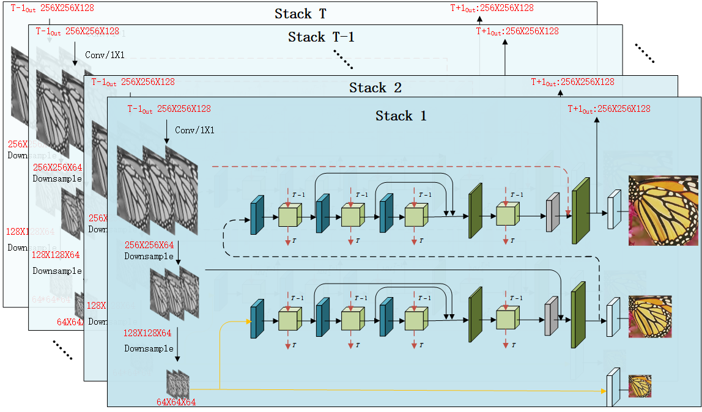

# cross-channel, cross-scale, and cross-stack network-pytorch

## Usage
### Training
```
usage: train_test.py [-h] [--batchSize BATCHSIZE] [--nEpochs NEPOCHS] [--lr LR]
               [--step STEP] [--cuda] [--resume RESUME]
               [--start-epoch START_EPOCH] [--threads THREADS]
               [--pretrained PRETRAINED]

Pytorch SRDenseNet train

optional arguments:
  -h, --help            show this help message and exit
  --batchSize BATCHSIZE
                        training batch size
  --nEpochs NEPOCHS     number of epochs to train for
  --lr LR               Learning Rate. Default=1e-4
  --step STEP           Sets the learning rate to the initial LR decayed by
                        10 every n epochs, Default: n=40
  --cuda                Use cuda?
  --resume RESUME       Path to checkpoint (default: none)
  --start-epoch START_EPOCH
                        Manual epoch number (useful on restarts)
  --threads THREADS     Number of threads for data loader to use, Default: 1
  --pretrained PRETRAINED
                        path to pretrained model (default: none)

```
### Test
```
usage: test.py [-h] [--cuda] [--model MODEL] [--imageset IMAGESET] [--scale SCALE]

Pytorch SRDenseNet Test

optional arguments:
  -h, --help     show this help message and exit
  --cuda         use cuda?
  --model MODEL  model path
  --imageset IMAGESET  imageset name
  --scale SCALE  scale factor, Default: 4
```

### Prepare Training dataset
 The training data is generated with Matlab Bicubic Interplotation, please refer [Code for Data Generation](https://github.com/thinkerww/SR_Version/tree/master/X4Experiment/data) for creating training files.

### Prepare Test dataset
 The test imageset is generated with Matlab Bicubic Interplotation, please refer [Code for test](https://github.com/thinkerww/SR_Version/tree/master/X4Experiment/TestSet) for creating test imageset.
 

 
 Non-overlapping sub-images with a size of 128 × 128 were cropped in the HR space.
 Other settings is the same as the original paper
 
 - Performance in X4 PSNR on Set5, Set14, and BSD100
  
| DataSet   |  Paper      |  
| ------------- |:----------:|
| Set5      | **32.15/0.8925** | 
| Set14     | **28.42/0.7778** |    
| BSD100    | **27.50/0.7337** |  
   
- Performance in X2 PSNR on Set5, Set14, and BSD100

| DataSet   |  Paper      |  
| ------------- |:----------:|
| Set5      | **38.00/0.9542** | 
| Set14     | **33.43/0.9166** |    
| BSD100    | **32.18/0.9005** | 